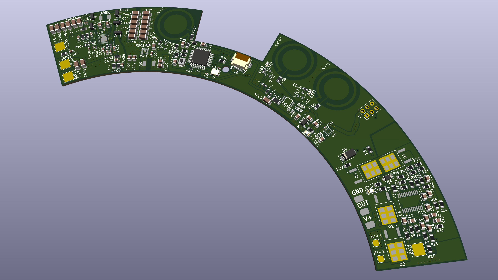
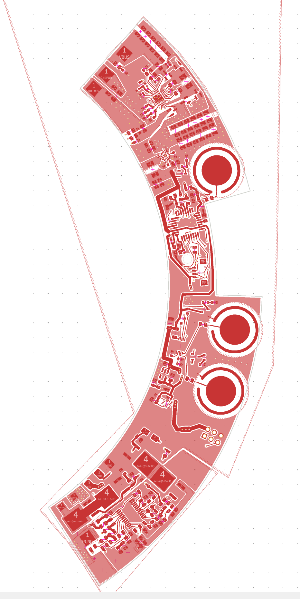

# heatkept-powercontrol-pcb
2-layer consumer power and control PCB with high-current heater drive, USB-C PD input, and multi-rail regulation. Includes layout visuals and bring-up documentation (no proprietary files).
# Consumer Power & Control PCB — HeatKept LLC

This repository documents a production-oriented **2-layer power and control PCB**
developed as part of a consumer electronics hardware program at **HeatKept LLC**.

> ⚠️ **IP Notice**  
> Full schematic source files, PCB layout design files, and manufacturing outputs
> are not shared due to intellectual property constraints.  
> This repository is intended to demonstrate **engineering approach, PCB layout discipline,
> and hardware validation practices** using representative visuals.

---

## Project Overview

- **High-current heater control** (~1.8–2 A @ 18–28 V)
- **MCU-driven PWM control**
- **USB-C Power Delivery–based input**
- **Multi-rail power architecture** (21–28 V → 5 V → 3.3 V)
- Designed with emphasis on **power integrity, thermal behavior, and bring-up robustness**

This board was taken from **schematic planning through PCB layout and into hardware bring-up**.

---

## Board Overview (3D)

This view provides:
- Mechanical context and connector orientation
- Component density and placement strategy
- Overall routing strategy for a constrained 2-layer stack-up

---

## PCB Layout — Top Layer

**Layout considerations**
- Placement driven by power flow and switching current loops
- Tight coupling of bulk and high-frequency decoupling capacitors
- Clear separation between high-current power paths and low-noise control circuitry
- Silk-screened reference designators to support bring-up and debugging

---

## PCB Layout — Bottom Layer

**Layout considerations**
- Copper pours optimized for current handling and thermal spreading
- Short return paths to control EMI and ground bounce
- Stitching vias used where required to reinforce ground continuity
- Minimal unnecessary routing to preserve plane integrity on a 2-layer board

---

## Power Architecture (High Level)

- Input voltage range: **18–28 V**
- USB-C Power Delivery used for input negotiation
- Buck conversion to intermediate rail
- LDO regulation for low-noise logic rails (5 V → 3.3 V)
- Heater load driven via a controlled high-current path

Design focus was placed on **stability, predictability, and thermal margin**.

---

## Bring-up & Validation Highlights

- Current-limited power-up and staged rail verification
- Verification of 5 V and 3.3 V rails under load
- PWM functionality validated across duty-cycle range
- Heater load transient behavior observed and verified
- Test points and LED indicators used to accelerate debugging

---

## Tools & Workflow

- **Schematic & PCB**: KiCad  
- **Board stack-up**: 2-layer  
- **Validation**: Bench power supply, DMM, oscilloscope  
- **Design priorities**: Power integrity, DFM awareness, debug visibility

---

## Why This Project Matters

This project reflects **end-to-end ownership** of a real production PCB:
from architectural planning and layout trade-offs to manufacturing readiness
and hardware validation.

It represents the level of rigor expected in professional
**hardware, power electronics, and PCB design roles**.
